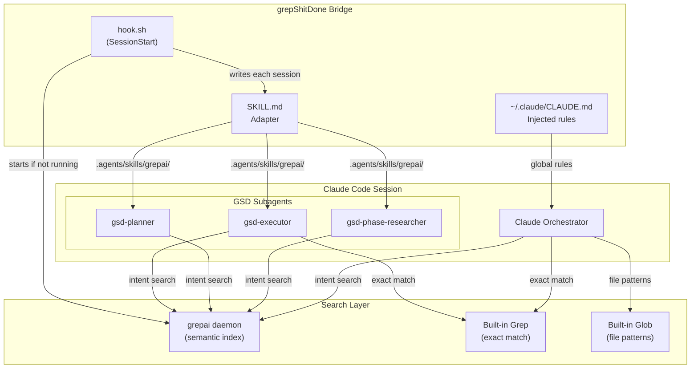
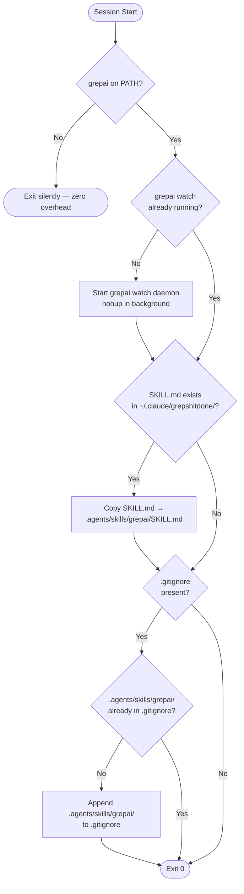
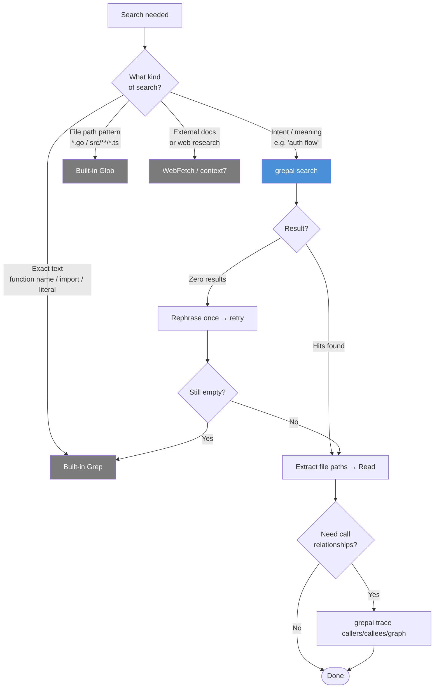
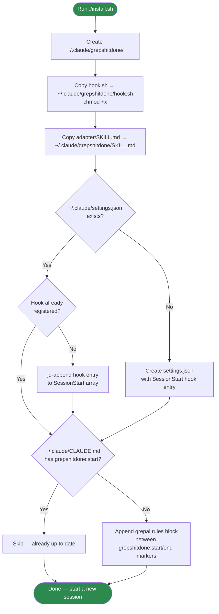

# grepShitDone

Bridges [grepai](https://github.com/yoanbernabeu/grepai) semantic search into
[GSD (Get Shit Done)](https://github.com/glittercowboy/get-shit-done) workflows.

Install once. Never think about it again.

---

## Architecture Overview



---

## How It Works

A `SessionStart` hook fires at the start of every Claude Code session:



GSD subagents (`gsd-executor`, `gsd-planner`, `gsd-phase-researcher`, etc.) automatically
scan `.agents/skills/` on boot and load any `SKILL.md` files they find. The adapter teaches
them when to use `grepai search` instead of `Grep`. The main Claude orchestrator gets the
same rules via an injected section in `~/.claude/CLAUDE.md`.

---

## Search Routing



> **GSD orchestration exception:** Internal GSD calls (checkpoint parsing, STATE.md queries,
> plan frontmatter scanning) use `bash grep` directly and are exempt from the routing rules above.
> These are infrastructure calls, not code searches.

---

## Installation Flow



---

## What Gets Installed

```
~/.claude/
└── grepshitdone/
    ├── hook.sh       ← SessionStart hook (registered in settings.json)
    └── SKILL.md      ← Adapter template (copied into projects each session)

~/.claude/settings.json
└── hooks.SessionStart[]  ← hook.sh entry appended

~/.claude/CLAUDE.md
└── <!-- grepshitdone:start/end -->  ← grepai rules block appended
```

Per-project (written each session, never committed):

```
<project>/
└── .agents/
    └── skills/
        └── grepai/
            └── SKILL.md   ← auto-generated, in .gitignore
```

Nothing else on your system is modified.

---

## The Incompatibilities This Solves

| Problem | Solution |
|---|---|
| GSD subagents can't invoke the `Skill` tool | Adapter is plain text — no invocation needed |
| GSD looks in `.agents/skills/`, not `.claude/skills/` | Hook writes adapter to the right place each session |
| grepai daemon not running | Hook starts it automatically |
| grepai says "never use Grep"; GSD uses `grep` internally | Adapter exempts GSD orchestration calls from the rule |
| grepai claims to replace WebSearch | Adapter scopes grepai to local code only |

---

## Prerequisites

- [grepai](https://github.com/yoanbernabeu/grepai) installed and on your PATH
- [GSD](https://github.com/glittercowboy/get-shit-done) installed in Claude Code
- `jq` installed (`brew install jq` on macOS)

---

## Install

```bash
git clone https://github.com/cyne-wulf/grepShitDone
cd grepShitDone
./install.sh
```

Start a new Claude Code session. Done.

## Update

```bash
cd grepShitDone
git pull
./install.sh
```

The next session picks up the updated adapter automatically.
